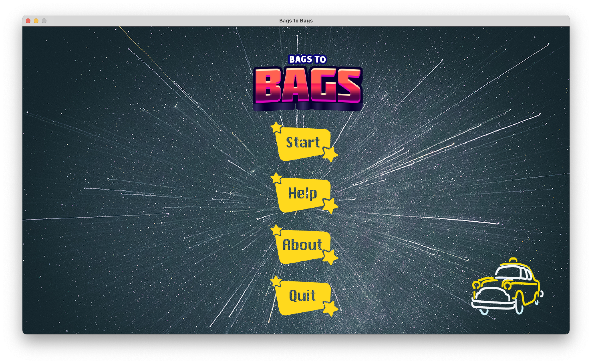
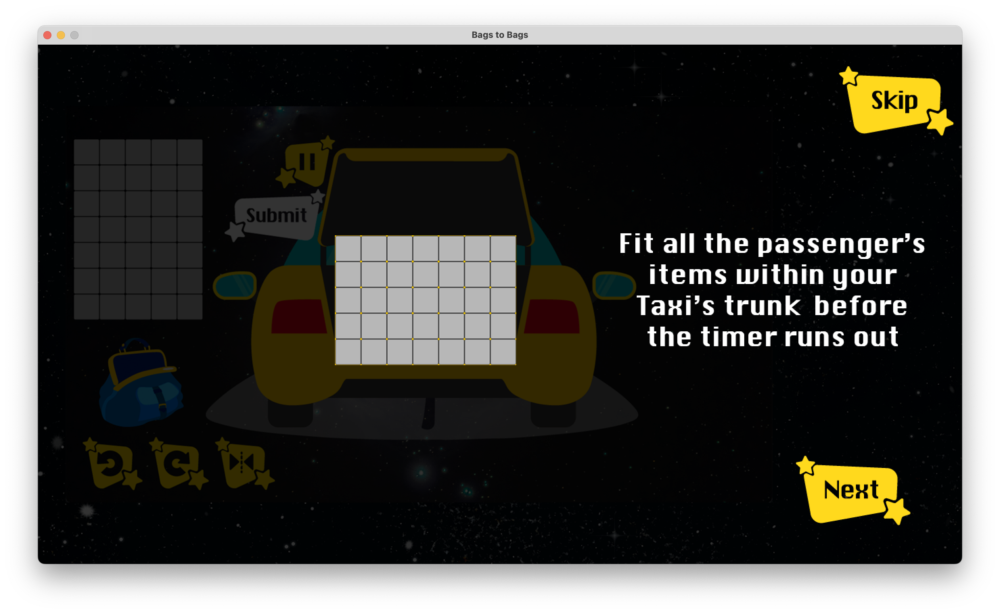
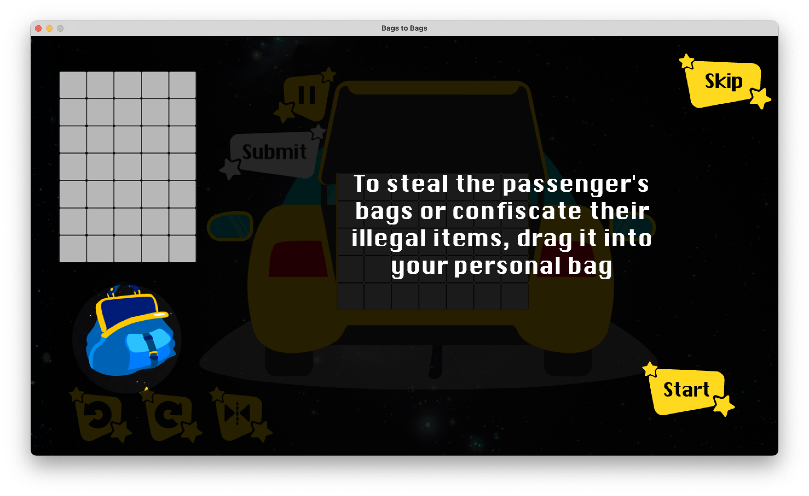
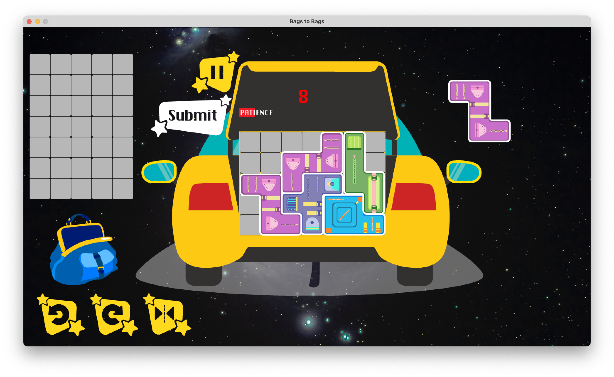

# Bags to Bags

A Cross-platform 2D Puzzle Game made in GameMaker as a submission for the NM4260 Game Design Module.

[Play Online](https://bags2bags.netlify.app) on our Netlify website.

## Made by
- Luo Mingxuan
- Samuel Chew
- Charmaine Chong
- Ian Hong

# Installation
- Download the latest release from the [Releases](https://github.com/ianfromdover/bags-to-bags/releases) page. Once the Beta version is ready, a Mac and Windows installer will be made available.

# Credits
Image Credits: 
- [Game Logo Template](https://assetstore.unity.com/packages/2d/gui/icons/20-logo-templates-with-customizable-psd-vector-sources-174999) by Pirate Parrot on Unity Asset Store 
- Main Menu Space Photo by [Casey Horner](https://unsplash.com/@mischievous_penguins?utm_source=unsplash&utm_medium=referral&utm_content=creditCopyText) on Unsplash 
- Alien Pickup Background Photo by [Bryan Goff](https://unsplash.com/photos/f7YQo-eYHdM?utm_source=unsplash&utm_medium=referral&utm_content=creditShareLink) on Unsplash 
- End of Trip/Day Photo by [Jeremy Perkins](https://unsplash.com/photos/uhjiu8FjnsQ?utm_source=unsplash&utm_medium=referral&utm_content=creditShareLink) on Unsplash 
- Amusement Park Vector Illustration by [pch.vector](https://www.freepik.com/author/pch-vector) on Freepik 
- All other graphics internally produced.

Sound Credits: 
- UI, Bag Placement, Alarm countdown sounds - Made in [Bfxr](https://www.bfxr.net), a sound-effect generator by increpare 
- [Car starting up and pulling away](https://freesound.org/people/amthomas101/sounds/175836/) by amthomas101 on Freesound 
- [Whistle](https://freesound.org/people/frisko28i/sounds/417392/) by frisko28i on Freesound
- Trunk Closing sound internally produced.

